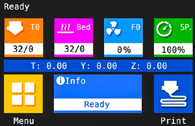

# Marlin Firmware Configuration for 3D Printer

This repository contains the Marlin firmware configuration for 3D printer, configured by José Sávy. The Texas-PRO is a Cartesian 3D printer with a build volume of 580x500x1000mm and a heated bed.

## Firmware Information

- **Firmware Version**: Marlin 2.1.2.4
- **Configuration Date**: Saturday, June 15, 2024
- **Configured By**: José Sávyo Soares Lira (savyosoares2@gmail.com)
- **Extruders**: 1 (Single Extruder)
- **Board**: BTT SKR MINI E3 V3.0 (BigTreeTech SKR Mini E3 V3.0 (STM32G0B0RE / STM32G0B1RE))
- **Architectures**: STM32G0
- **Environments**: STM32G0B1RE_btt

## Machine Specifications

- **Build Volume**: 580x500x1000mm
- **Heated Bed**: Yes
- **Number of Extruders**: 1

## Features

- **Advanced 3D Printing Firmware**: Utilizes the latest version of Marlin firmware to ensure optimal performance and reliability.
- **Custom Configuration**: Tailored specifically for the Texas-PRO 3D printer, ensuring compatibility and enhanced functionality.
- **Support for Advanced Hardware**: Configured for the BTT SKR MINI E3 V3.0 board, supporting STM32G0 architectures.

## How to Use

1. **Clone the Repository**:
    ```bash
    git clone https://github.com/your-username/marlin-config.git
    cd marlin-config
    ```

2. **Open the Project in PlatformIO**:
    - Open Visual Studio Code.
    - Install the PlatformIO extension if not already installed.
    - Open the cloned repository folder.

3. **Compile and Upload the Firmware**:
    - Select the appropriate environment (`STM32G0B1RE_btt`) in PlatformIO.
    - Compile the firmware by clicking on the "Build" button.
    - Upload the firmware to your 3D printer.

## Screenshot



## Contributing

Contributions are welcome! Please fork the repository and submit a pull request with your changes.

## License

This project is licensed under the MIT License - see the [LICENSE](LICENSE) file for details.

## Contact

For any questions or support, please contact José Sávyo at savyosoares2@gmail.com.
